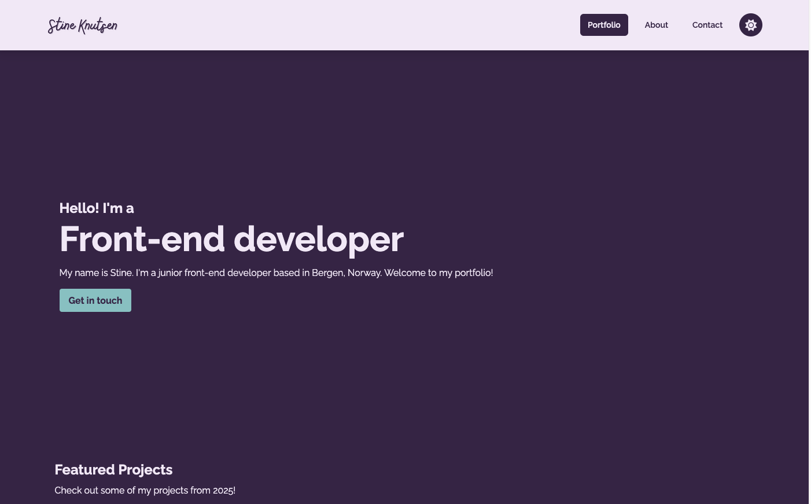

# Portfolio for Stine Knutsen

This portfolio is built with React and Tailwind. It was made for the Noroff Front-End Development Portfolio 2 course assignment. It is hosted at https://stineknutsen-portfolio.netlify.app/



## Pages

- Portfolio page: Features a hero section and three projects
- Project page: Dynamically renders project image and article, with links to repo and live page
- About page: Information about me as a developer
- Contact page: Shows a couple different ways to get in touch

## Features

- Dynamically rendered project article page
- Responsive design
- Dark/light mode

## Technologies used

- Tailwind CSS
- React
- React Router
- JavaScript
- Netlify

## Getting Started

1. Clone this repository

```bash
git clone https://github.com/stineknutsen/portfolio-2.git
```

2. Install dependencies

```bash
npm install
```

3. Available scripts

```bash
npm run dev
```

```bash
npm run build
```

```bash
npm run preview
```

The app should now run at localhost

## Contact

If you want to get in touch, you can reach me here:

[My LinkedIn Page](https://www.linkedin.com/in/stine-knutsen-8b9557209/)
